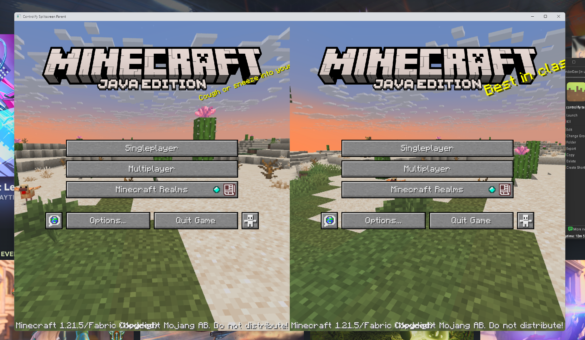
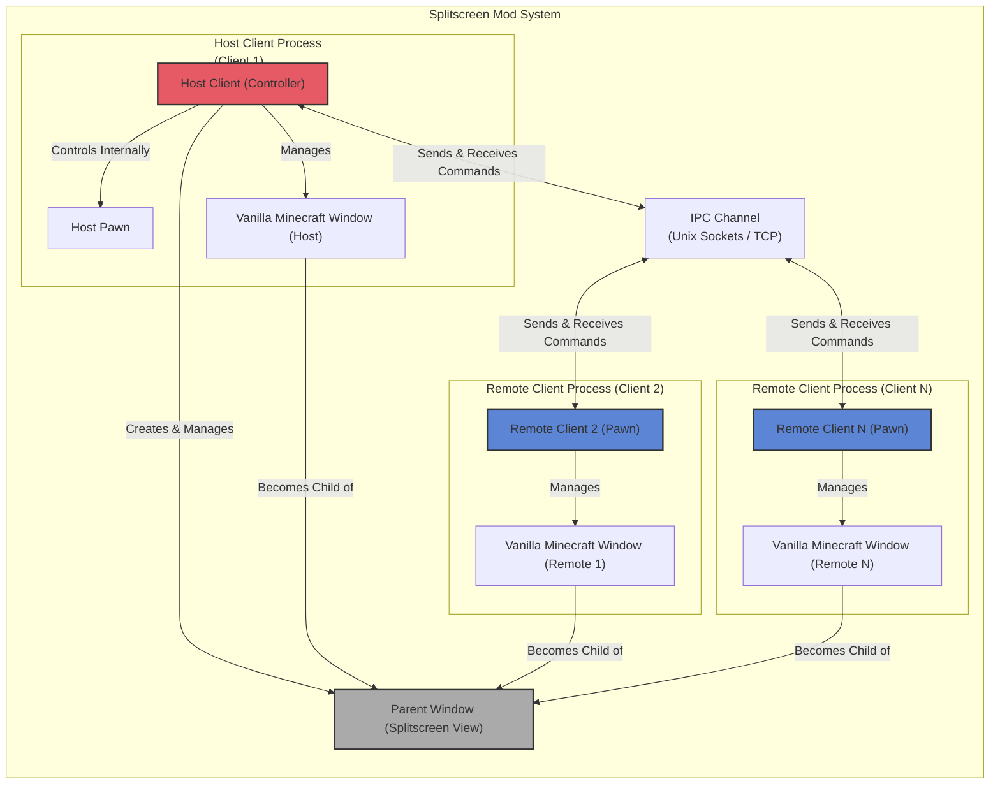

# Controlify Splitscreen

## Overview

Controlify Splitscreen is a sub-mod for Controlify that adds local splitscreen multiplayer functionality to Minecraft. It allows multiple players to play on the same computer using different controllers, each with their own game window arranged in a splitscreen layout.

The mod works by creating a parent window that hosts multiple Minecraft client instances (called "pawns"), each running in its own process. These instances communicate with each other using Inter-Process Communication (IPC), allowing them to coordinate window positioning, focus, and game state.

## Architecture

### High-Level Architecture

### Client-Server Model

The splitscreen implementation follows a client-server architecture:

- **Controller (Host)**: The main Minecraft instance that creates the parent window and manages the splitscreen layout
- **Pawns (Clients)**: All Minecraft instances, including the controller itself, are pawns. The controller instance has its own pawn that controls itself using the same abstraction as remote pawns

### Bootstrap Process

1. When a Minecraft client starts with Controlify Splitscreen enabled, it checks if a controller already exists
2. If no controller exists, it becomes the controller and creates a parent window
3. If a controller exists, it becomes a pawn and connects to the controller
4. The controller assigns a position in the splitscreen layout to each pawn

## Key Components

### Core Components

- **`SplitscreenBootstrapper`**: The main entry point that determines whether to become a controller or pawn
- **`SplitscreenController`**: Manages the controller side, including the parent window and pawn connections
- **`SplitscreenPawn`**: Interface for controlling a client instance (local or remote)
- **`LocalSplitscreenPawn`**: Implementation of SplitscreenPawn for the local client. Every Minecraft client is a pawn, including the controller which uses LocalSplitscreenPawn to control itself
- **`ControllerBridge`**: Interface for communication between pawns and the controller

### Window Management

- **`ParentWindow`**: Creates and manages the parent window that all pawns attach to
- **`SplitscreenPosition`**: Defines the possible positions and sizes for each splitscreen window
- **`WindowManager`**: Interface for embedding child windows inside the parent window
  - **`Win32WindowManage`r**: Implementation for Windows
  - **`X11WindowManager`**: Implementation for Linux X11

### IPC System

- **`IPCMethod`**: Defines the methods of connection/hosting for IPC
  - **`TCP`**: Uses TCP/IP over loopback (localhost)
  - **`Unix`**: Uses AF_UNIX sockets (file descriptor on Unix or named pipe on Windows)
- **`ControllerConnectionListener`**: Listens for new pawn connections on the controller side
- **`PawnConnectionListener`**: Manages the connection to the controller on the pawn side

## Component Interactions

1. **Initialization**:
   - SplitscreenEntrypoint calls SplitscreenBootstrapper.bootstrap()
   - SplitscreenBootstrapper determines whether to become a controller or pawn
   - If controller, creates SplitscreenController and sets up IPC server
   - If pawn, creates PawnConnectionListener and connects to controller

2. **Window Management**:
   - Controller creates `ParentWindow`
   - Each pawn's window is embedded in the ParentWindow using `WindowManager`
   - `SplitscreenPosition` determines the layout of each pawn's window

3. **Communication**:
   - Controller and pawns communicate using IPC
   - `ControllerBridge` and `SplitscreenPawn` provide an abstraction for this communication
   - Every Minecraft client is a pawn, including the controller itself
   - On controller side, the controller has its own pawn instance (`LocalSplitscreenPawn`) that controls itself directly, while remote pawns are controlled through IPC
   - On pawn side, calls are sent as packets to the controller

## Platform Support

- **Windows**: Fully supported
- **Linux (X11)**: Supported but untested
- **Linux (Wayland)**: Unsupported (doesn't support reparenting windows)
- **macOS**: Unsupported (can't reparent windows from different processes)

## Setup and Usage

1. Install Controlify and Controlify Splitscreen
2. Launch Minecraft with Controlify Splitscreen enabled
3. The first instance becomes the controller and creates the parent window
4. Launch additional instances to create pawns that connect to the controller
5. Each pawn will be assigned a position in the splitscreen layout
6. Connect controllers to play with multiple players

## Technical Limitations

- **Platform Support**: Only works on Windows and Linux with X11
- **Performance**: Running multiple Minecraft instances requires significant system resources
  - Unlike natively implemented games with splitscreen, each splitscreen part has its own copy of resources, render context, etc.
  - This means significantly more overhead than a native splitscreen implementation
- **Window Management**: Some window operations (like fullscreen) are disabled (for now)

## Development

The codebase is organized into several packages:

- `dev.isxander.controlify.splitscreen`: Core classes
- `dev.isxander.controlify.splitscreen.host`: Controller-side classes
- `dev.isxander.controlify.splitscreen.remote`: Remote pawn-side classes
- `dev.isxander.controlify.splitscreen.ipc`: IPC system
- `dev.isxander.controlify.splitscreen.window`: Window management
