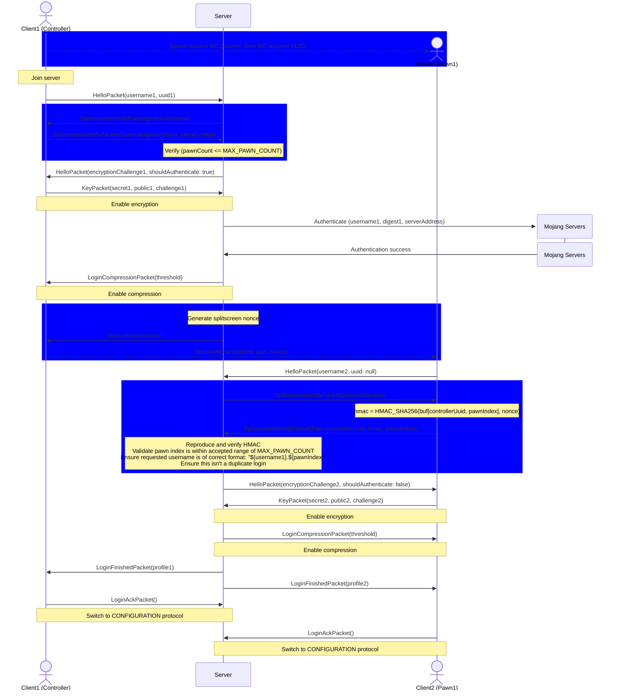

# Splitscreen on Servers

Controlify Splitscreen has server-side support.

It allows the host of a splitscreen session to use their Minecraft account to authenticate *all* players in the session.

## Login protocol

The following diagram shows the login phase. The blue sections indicate the modded, splitscreen part of the protocol.

